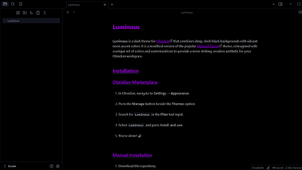

# Luminous

**Luminous** is a dark theme for [Obsidian](https://obsidian.md/) that combines deep, sleek black backgrounds with vibrant neon accent colors. It is a modified version of the popular [Material Ocean](https://github.com/dragonwocky/obsidian-material-ocean) theme, reimagined with a unique set of colors and customizations to provide a more striking, modern aesthetic for your Obsidian workspace.

## Installation

### Obsidian Marketplace

1. In Obsidian, navigate to **Settings** → **Appearance**.
2. Press the **Manage** button beside the **Themes** option.
3. Search for `Luminous` in the **Filter** text input.
4. Select `Luminous` and press **Install and use**.
5. You're done! 🎉

### Manual Installation

1. Download this repository.
2. Copy it into your vault's `.obsidian/themes` directory.
3. In Obsidian, navigate to **Settings** → **Appearance**.
4. Select `Luminous` from the dropdown under the **Themes** option.
5. You're done! 🎉

## Features

**Luminous** is designed to enhance your Obsidian experience, with a number of changes to the interface, layout, and typography. Key features include:

- **Customizable neon accent colors** for a vibrant and dynamic appearance.
- **Improved element spacing, sizing, and positioning** for a more consistent and enjoyable editing experience.
- **The window minimize/maximize/close button icons have been replaced** with those from the [Lucide](https://lucide.dev/) icons toolkit, giving a smoother and more modern look.
- **The sidebar toggle button** has been accented and the surrounding borders have been simplified and rounded for a cleaner design.
- **Code block handling**:
  - **Long code lines overflow and are scrolled horizontally** instead of wrapping onto the next line.
  - Code blocks are styled to maintain contrast and readability.
- **Images are slightly rounded, headings are underlined**, and callout arrows are right-aligned.
- **Checkboxes are circular** with completed tasks greyed out instead of crossed out. Alternative checkbox styles include:
  - **`- [/]`** for incomplete tasks (half-filled circle).
  - **`- [-]`** for cancelled tasks (crossed out).

## Supported Plugins

**Luminous** works seamlessly with most Obsidian plugins. Additional styling has been applied to ensure compatibility and fix minor display issues with the following plugins:

- [Calendar](https://github.com/liamcain/obsidian-calendar-plugin)
- [Full Calendar](https://github.com/davish/obsidian-full-calendar)
- [Dictionary](https://github.com/phibr0/obsidian-dictionary)
- [Self-hosted Livesync](https://github.com/vrtmrz/obsidian-livesync)

## Disclaimer

It has not been tested on all platforms or with all features and may not work as expected with all future updates. If you notice something looks wrong, please open a bug report or pull request so it can be fixed.

Full credit for the original **Material Ocean** color palette goes to the original [Material Theme](https://material-theme.site/). The Luminous theme is a modified version of **Material Ocean**, with adjusted colors and additional tweaks to suit the style and needs of its users.
